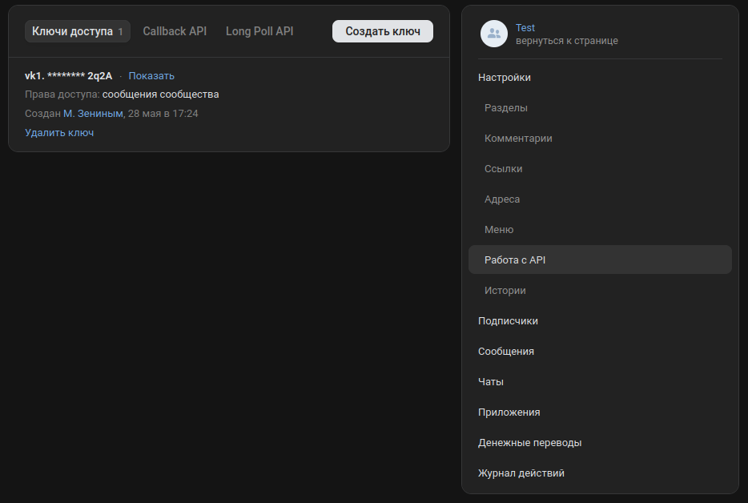
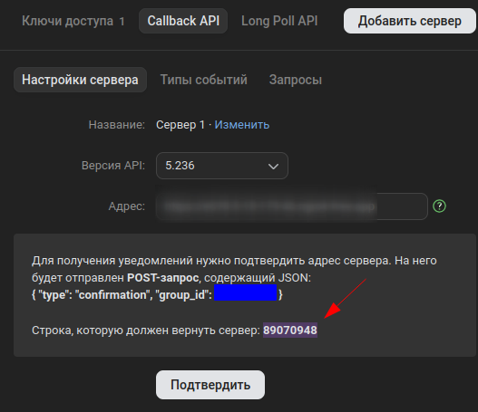

# Сервис для отправки сообщений от лица сообщества в ответ
## Быстрый гайд для первого запуска:
- Добавить в [application-prod.properties](src/main/resources/application-prod.properties) в значение поля `vk.access-token` сгенерированный ключ  

- Открыть меню `Callback API`, ввести статический адрес вашей машины в поле `Адрес`, выбрать в `Версия API` значение, указанное в [application.properties](src/main/resources/application.properties), затем поместить указанную строку (для возврата сервером) в значение поля `vk.confirmation-code` в [application-confirmation.properties](src/main/resources/application-confirmation.properties), также взять указанное значение `group_id` и записать в значение поля `vk.group.id` в [application.properties](src/main/resources/application.properties):  

- Запустите сервер с активированным профилем `confirmation`:
```bash
docker-compose up
./gradlew bootRun --args='--spring.profiles.active=confirmation'
```
- После успешного запуска нажмите кнопку подтвердить, после подтверждения можно запускать основное приложение (`docker-compose` с `postgres` уже запущен в предыдущем шаге):
```bash
./gradlew bootRun --args='--spring.profiles.active=prod'
```
## Более подробное пояснение по конфигурации:
- Указать формат сообщения можно в [application.properties](src/main/resources/application.properties) в поле `send-back.format` (`%s` обозначает место, куда будет вставлена цитата)
- Вы можете развернуть сервер `postgres` на другом узле - тогда в [application.properties](src/main/resources/application.properties) понадобится изменить значения полей `spring.datasource.*`, запускать Docker в этом случае не потребуется, однако придется исполнить скрипт [init.sql](docker-scripts/postgres/init.sql) для добавления нужных для работы таблиц
